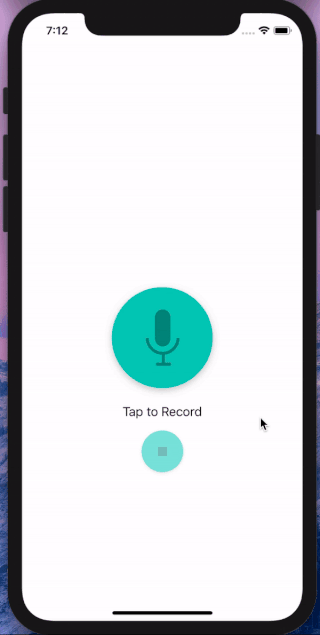
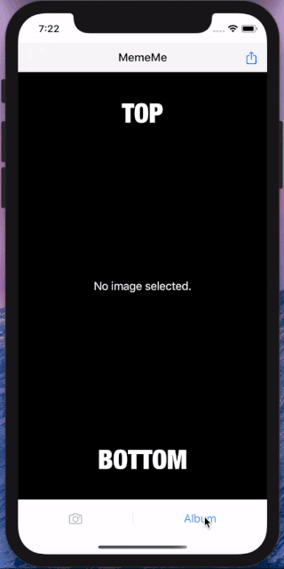
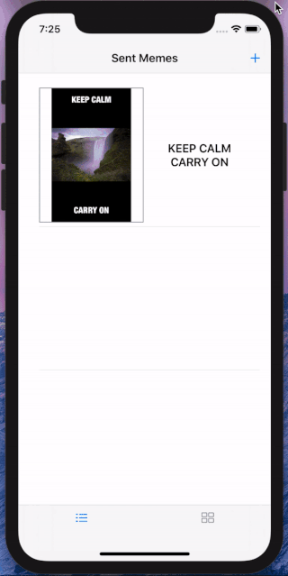
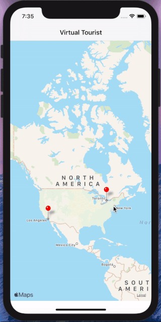

# Projects for Udacity iOS Development Nanodegree

## Overview
This repo contains my implementation for all 6 projects as part of my completing Udacity iOS Development Nanodegree Program. Although the program teaches UIKit for the UI part, I chose to use SwiftUI as it's the next gen of iOS development. However SwiftUI is still relatively new and it lacks certain functionalities, so some UIKit components are used too such as MapKit, UICollectionView etc.

## Projects

### Perfect Pitch
An app that allows users to record audio and then play it back with different audio effects.

### MemeMe 1.0
The first version of the MemeMe app that enables a user to take a picture, add text at the top and bottom to form a Meme, and share it on social media or by SMS or email.

### MemeMe 2.0
The second version of the MemeMe app that can not only generate Memes as in the first version, but also show all generated Memes in a tab view with two tabs: a table view and a collection view.

### On the Map
An app that shows posts from all other users in either a map view or a table view. The map view shows each post as a pin based on its geo-location. By tapping on the pin, the poster's name and URL will show in the callout view. Clicking on the callout view opens that URL in the browser. Of course the user is also able to post their own information (address and URL). The app can reverse-geocode the address string to a location, and show the post on the map view and the table view.

### Virtual Tourist
An app that allows users to drop pins on a map, as if they were stops on a tour. Users will then be able to view pictures for that location downloaded from Flickr. The pictures and their association with the pin are persisted on their device.

### GIFU (Final Project)
An app that allows users to search for GIFs using keywords, as well as to explore trending GIFs. A more detailed README for this app is in the "GIFU" folder.

